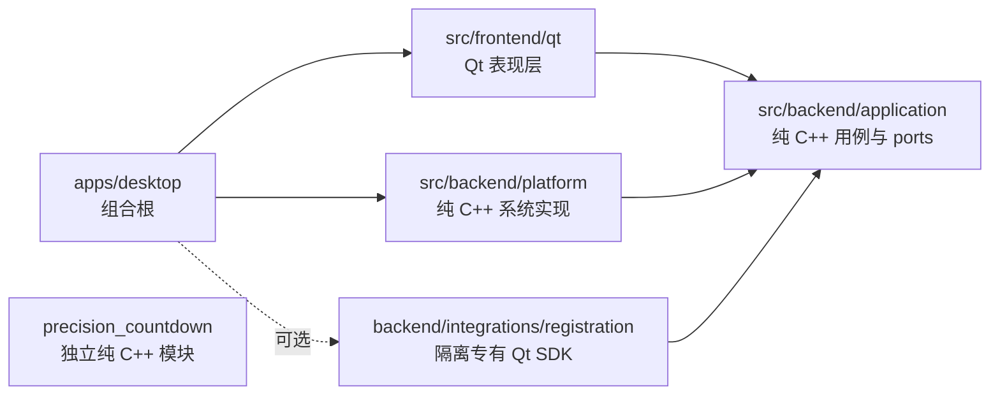

# Qt / C++ 跨平台工程模板

这是一个以纯 C++ 业务层为核心、Qt Widgets 仅作为桌面界面的工程模板。它统一使用 CMake + Ninja，支持 Windows（MSVC）、macOS（AppleClang）和 Linux（GCC/Clang），也可以完全关闭 Qt 构建。

## 设计目标

- application、modules 和 platform 不包含 Qt 头文件或 Qt 类型。
- GUI 只能通过 application 的公开接口调用业务能力。
- 系统能力通过 platform 实现，专有 SDK 通过 integrations 接入，不能反向污染业务层。
- 所有 target 显式声明源码、include 可见性和依赖，不使用递归 `GLOB`。
- 构建产物只写入 `build/`，不会污染源码目录。
- UTF-8、C++20、警告策略、测试、格式化和 CI 在三平台保持一致。



详细边界和新增模块规则见 [docs/architecture.md](docs/architecture.md)。

## 项目结构与文件职责

```text
Qt_Cmake/
├── apps/desktop/                  # 桌面程序入口与依赖组装
├── cmake/                         # 项目级 CMake 公共模块
├── docs/                          # 架构等设计文档
├── scripts/                       # 跨平台环境初始化脚本
├── src/
│   ├── backend/                   # 与界面无关的 C++ 后端
│   │   ├── application/           # 用例编排、业务门面和抽象端口
│   │   ├── modules/               # 可独立开发和测试的业务模块
│   │   ├── platform/              # 文件、时间、路径等系统能力实现
│   │   └── integrations/          # 第三方 SDK 或外部服务适配
│   └── frontend/qt/               # Qt 表现层
│       ├── application/           # GUI 生命周期与界面状态
│       ├── include/               # Qt 前端对外公开接口
│       ├── views/                 # 窗口、对话框及对应 .ui
│       ├── widgets/               # 可复用自定义控件
│       ├── resources/             # 编译进 Qt Resource System 的资源
│       ├── translations/          # Qt 翻译源文件
│       └── assets/                # 打包使用的字体和应用图标
├── third_party/                   # 外部 SDK 头文件与预编译二进制
├── tests/                         # 与生产模块对应的自动化测试
├── CMakeLists.txt                 # 工程入口、版本和全局构建选项
├── CMakePresets.json              # 可提交、跨平台共享的构建预设
├── CMakeUserPresets.json          # 自动生成的本机预设，不提交 Git
├── CONTRIBUTING.md                # 团队协作与提交规范
└── README.md                      # 环境、架构和使用入口
```

### 根目录

| 文件或目录 | 职责 |
|---|---|
| `CMakeLists.txt` | 声明工程、C++ 标准、构建选项、Git 版本，并组织 `third_party`、`src`、`apps` 和 `tests`。这里只放项目级配置，不直接堆业务源码。 |
| `CMakePresets.json` | 保存团队共享的 configure、build 和 test 预设，所有平台统一使用 Ninja。 |
| `CMakeUserPresets.json` | 由环境脚本生成，保存当前机器的 Qt、Ninja 和编译器路径。该文件包含本机绝对路径，已被 Git 忽略。 |
| `CONTRIBUTING.md` | 约定分支、提交、格式化、测试和评审流程，供多人协作时统一执行。 |
| `docs/architecture.md` | 记录模块边界、依赖方向和扩展规则；README 负责快速使用，设计细节放在这里。 |

### `apps/desktop`：程序组合根

| 文件 | 职责 |
|---|---|
| `main.cpp` | 创建 application、platform、integration 和 GUI 对象，注入依赖并启动程序。只做组装，不实现业务逻辑或复杂界面逻辑。 |
| `CMakeLists.txt` | 定义最终桌面可执行文件，链接前端和后端 target，并配置安装、部署和平台属性。 |
| `app.rc.in` | Windows 可执行文件资源模板，写入版本、产品名称和 `.ico` 图标。 |

组合根是唯一允许同时了解前端和后端具体实现的位置。这样更换 Qt 界面、文件存储或第三方 SDK 时，不需要修改业务核心。

### `src/backend/application`：应用层

| 文件 | 职责 |
|---|---|
| `ports.hpp` | 定义业务所需的抽象端口，例如设置存储、时钟和授权能力；不能依赖 Qt 或具体 SDK。 |
| `application_service.hpp/.cpp` | 对外提供稳定的业务用例接口，负责流程编排，不负责窗口、文件格式或操作系统 API。 |
| `CMakeLists.txt` | 定义纯 C++ application target 及公开头文件边界。 |

这里是前后端之间的契约。Qt 前端只调用应用层公开接口；platform 和 integrations 负责实现应用层定义的端口。

### `src/backend/platform`：系统能力实现

| 文件 | 职责 |
|---|---|
| `file_settings_store.hpp/.cpp` | 设置存储端口的文件实现，处理持久化读写。 |
| `platform_paths.hpp/.cpp` | 封装 Windows、macOS 和 Linux 的路径差异。 |
| `system_clock.hpp` | 系统时钟端口的实现。 |
| `CMakeLists.txt` | 定义 platform target，并声明其对 application 接口的依赖。 |

新增文件存储、数据库、日志落盘或操作系统服务实现时，应放在此层，而不是写进窗口类或应用层。

### `src/backend/modules`：独立业务模块

当前 `precision_countdown/` 是高精度倒计时模块：

- `include/qtcpp/precision_countdown/`：公开 API 和轻量信号机制。
- `src/precision_countdown.cpp`：模块内部实现。
- `CMakeLists.txt`：独立 target，可被 GUI、CLI 或测试单独链接。

适合放入这里的代码应具备明确业务边界、尽量不依赖 Qt，并能独立测试。新模块使用相同的 `include/ + src/ + CMakeLists.txt` 结构。

### `src/backend/integrations` 与 `third_party`：第三方隔离

| 目录 | 职责 |
|---|---|
| `src/backend/integrations/registration/` | 将注册码 SDK 转换为 application 层的 `LicenseGateway` 接口，第三方类型不能越过此边界。 |
| `third_party/registration_code/include/` | 保存第三方 SDK 公开头文件。 |
| `third_party/registration_code/lib/mac/` | 保存 macOS 动态库。 |
| `third_party/registration_code/lib/win/` | 保存 Windows MSVC 使用的 `.lib` 和运行时 `.dll`。 |
| `third_party/registration_code/CMakeLists.txt` | 将平台二进制包装为可链接的 CMake target。 |

`third_party` 只保存无法通过包管理器稳定获得的第三方产物，不放项目自身业务代码。Linux 当前没有对应的注册码 SDK，因此该功能在 Linux 默认关闭。

### `src/frontend/qt`：Qt 表现层

| 目录 | 职责 |
|---|---|
| `include/qtcpp/gui/` | Qt 前端对组合根公开的最小接口，例如 `GuiApplication`。内部窗口头文件不从这里暴露。 |
| `application/` | 管理 GUI 生命周期、窗口创建和纯界面状态；`ui_settings` 只处理 UI 偏好，不承载核心业务。 |
| `views/` | 每个窗口或对话框的 `.hpp`、`.cpp`、`.ui` 放在一起，便于按界面并行开发。 |
| `widgets/` | 多个界面可复用的自定义 Qt 控件。只被单个窗口使用的细节优先留在对应 view 内。 |
| `resources/` | `resource.qrc`、样式表和运行期图片；这些文件会编译进 Qt 资源系统，通过 `:/` 路径访问。 |
| `translations/` | Qt Linguist 使用的 `.ts` 翻译源文件。 |
| `assets/` | 应用打包阶段使用的字体和平台图标；与运行期 `qrc` 资源分开管理。 |
| `CMakeLists.txt` | 定义 Qt 前端 target，启用 AUTOUIC/AUTOMOC/AUTORCC，并显式列出源码、资源和 Qt 依赖。 |

Qt 层只负责展示、收集输入和调用 application 用例。业务判断、持久化和平台 API 不应进入 `views` 或 `widgets`。

### `tests`：自动化测试

测试目录按生产模块镜像组织：

- `application/`：验证业务用例编排和端口交互。
- `platform/`：验证文件存储等系统能力实现。
- `precision_countdown/`：验证独立业务模块。
- `test_support.hpp`：多个测试共用的最小辅助代码。
- `CMakeLists.txt`：定义测试可执行文件并注册到 CTest。

新增生产模块时，应同步新增对应测试目录。核心业务优先使用纯 C++ 测试，避免为了测试业务逻辑而启动 Qt GUI。

### `cmake`：构建公共模块

| 文件 | 职责 |
|---|---|
| `GitVersion.cmake` | 从最近的 Git Tag 解析主、次、修订版本，并计算提交数、短哈希和 dirty 状态。 |
| `ProjectOptions.cmake` | 集中管理 UTF-8、警告、sanitizer、clang-tidy 等可复用编译策略。 |
| `project_config.hpp.in` | 生成包含项目名、组织名和 Git 版本信息的 C++ 配置头文件。 |

平台和编译器判断应尽量封装在这里或具体 target 中，不要把大量条件分支散落到每一级 `CMakeLists.txt`。

### `scripts`：跨平台开发脚本

| 文件 | 职责 |
|---|---|
| `setup-toolchain.cmake` | 真正的跨平台环境发现逻辑：查找 Ninja、Qt、编译器，并生成 `CMakeUserPresets.json`。 |
| `setup-toolchain.sh` | macOS/Linux 的薄封装，只负责将参数交给 CMake 脚本。 |
| `setup-toolchain.ps1` | Windows PowerShell 的薄封装，MSVC 环境由底层 CMake 脚本结合 Visual Studio 工具发现。 |

自动化脚本统一放在 `scripts/`，核心逻辑只维护一份 CMake 实现，避免三平台脚本行为逐渐不一致。

### 新代码放置规则

| 要新增的内容 | 放置位置 |
|---|---|
| 业务用例或前后端契约 | `src/backend/application/` |
| 独立、可复用的纯 C++ 业务能力 | `src/backend/modules/<module>/` |
| 文件、数据库、日志、系统 API 实现 | `src/backend/platform/` |
| 第三方 SDK 或外部服务接入 | `src/backend/integrations/<integration>/` |
| 第三方预编译头文件或二进制 | `third_party/<library>/` |
| Qt 窗口或对话框 | `src/frontend/qt/views/` |
| 可复用 Qt 控件 | `src/frontend/qt/widgets/` |
| 样式、运行期图片和 Qt 资源 | `src/frontend/qt/resources/` |
| 应用图标、打包字体等发布资产 | `src/frontend/qt/assets/` |
| 新桌面程序、CLI 或服务入口 | `apps/<application>/` |
| 对应模块测试 | `tests/<module>/` |

新增依赖时必须保持方向：`frontend -> application <- platform/integrations`。application 不能反向包含 Qt、操作系统实现或第三方 SDK 头文件。

## 环境要求

| 平台 | 编译器 | Qt Kit |
|---|---|---|
| Windows x64 | Visual Studio 2022 MSVC | Qt 6.5+ `msvc2022_64` |
| macOS | AppleClang | Qt 6.5+ `macos` |
| Linux x64 | GCC 或 Clang | Qt 6.5+ `gcc_64` 或发行版 Qt 6 |

所有平台只需要 CMake 3.25+、Ninja 和对应的 C++ 编译器；构建 GUI 时再安装 Qt 6。环境发现脚本本身使用 CMake，不依赖 Python。

## 首次配置

macOS / Linux：

```bash
./scripts/setup-toolchain.sh
cmake --preset local-dev
cmake --build --preset local-dev
ctest --preset local-dev
```

Windows PowerShell：

```powershell
.\scripts\setup-toolchain.ps1
cmake --preset local-dev
cmake --build --preset local-dev
ctest --preset local-dev
```

环境脚本会自动发现 Ninja、Qt 6 和编译器，并生成本机专用的 `CMakeUserPresets.json`。Windows 通过 `vswhere` 和 `VsDevCmd.bat` 获取 MSVC/Windows SDK 环境；生成文件已加入 `.gitignore`，不要提交个人绝对路径。需要覆盖已有文件时使用 `--force`，无法自动发现 Qt 时可传 `--qt <Qt前缀>`。

也可以不经过 shell/PowerShell wrapper，直接执行同一个跨平台 CMake 脚本：

```bash
cmake -DFORCE=ON -P scripts/setup-toolchain.cmake
```

## 完全不使用 Qt

```bash
cmake --preset core-only
cmake --build --preset core-only
ctest --preset core-only
```

该预设不会执行 `find_package(Qt6)`，可用于服务端、CLI、单元测试和纯 C++ CI。

## 可选注册码模块

注册码 SDK 默认关闭：

```bash
cmake --preset local-dev -DQTCPP_ENABLE_LICENSING=ON
cmake --build --preset local-dev
```

SDK 的 Qt 类型只存在于 `src/backend/integrations/registration`。仓库目前只有 Windows 和 macOS SDK 二进制，因此 Linux 必须保持关闭，或由团队提供实现同一 `LicenseGateway` port 的 Linux integration。

## Git 自动版本

版本从最近的 `vMAJOR.MINOR.PATCH` Tag 提取，构建号为当前 `HEAD` 的提交数，同时写入短提交哈希和 dirty 状态：

```bash
git tag v1.2.0
```

无 Git 元数据或没有合法 Tag 时回退到 `1.0.0`，源码包和浅克隆仍可构建。生成头文件位于 build 目录的 `generated/qtcpp/project_config.hpp`。

## 常用质量开关

```bash
cmake --preset core-only -DQTCPP_ENABLE_SANITIZERS=ON
cmake --preset local-dev -DQTCPP_ENABLE_CLANG_TIDY=ON
cmake --preset local-dev -DQTCPP_WARNINGS_AS_ERRORS=ON
```

提交前至少执行构建、`ctest` 和 `clang-format`。团队协作约定见 [CONTRIBUTING.md](CONTRIBUTING.md)。

## 定制模板

新项目至少修改根 `CMakeLists.txt` 中的：

- `project(QtCppTemplate ...)`
- `QTCPP_ORGANIZATION`
- `QTCPP_APPLICATION_NAME`
- `QTCPP_BUNDLE_IDENTIFIER`
- macOS 发布签名使用的 `QTCPP_CODESIGN_IDENTITY`（默认 `-` 为本地 ad-hoc 签名）
- `src/frontend/qt/assets/icons/` 和可选注册码 SDK

不要把业务代码写进 `src/frontend/qt/` 或 `main.cpp`；`main.cpp` 只负责组装依赖并启动应用。
