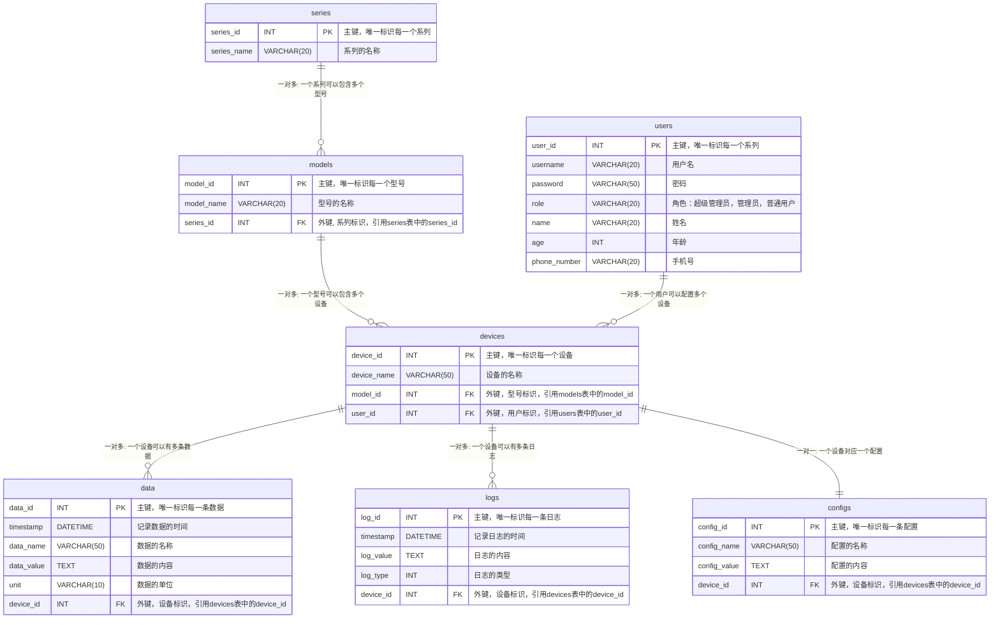

<b>大电源通用平台设计方案</b>

[TOC]

## 一、项目背景和目标

## 二、需求分析

## 三、架构设计

- 通讯层：负责底层的通讯（包括 TCP，UDP，串口等），对外提供通讯接口
- 产品层：产品UI负责用户接口的输入和输出，界面内容通过通讯协议进行封包下发到通讯接口进行发送内容，收到的内容通过通讯协议进行解析，最后发送给产品UI进行输出展示。通讯协议解析的数据还会发送到数据库中进行数据存储
- 主界面：
    - 电源视图：通过设备管理中的设置内容进行界面显示
    - 数据分析：选取不同设备进行数据导出功能、出报表等功能
    - 设备管理：在数据库中查询系列进行展示，然后选取相应系列之后再在数据库中查询型号，然后进行查询型号下的设备记录，也可以创建设备自定义命名，然后同步到数据库中
    - 日志管理：警告，故障，通讯连接等进行记录，通过数据库进行查询
    - 用户管理：
        - 超级管理员：对软件的Logo, 名称进行修改，版本公司信息隐藏与否等操作
        - 管理员：查询，删除所有普通用户的数据和日志等内容，可以对普通用户增删改查
        - 普通用户：独立的设备配置，数据内容，日志内容
    - 系统设置：例如文件默认存储路径等操作

## 四、模块设计

## 五、数据库设计

> [!CAUTION]
>
> 如果删除一个系列，跟这个系列有关的都会删除，在UI中要给出提示是否导出数据

## 六、界面设计

[UI原型图](UI.rp)

## 七、安全设计

### 1. 软件注册码验证与授权

- **注册码激活验证**：
    - 唯一性：通过读取主板序列号，然后转换成UUID。
    - 时效性：具有激活到哪天的功能。

### 2. 用户身份验证与授权

- **用户身份验证**：采用基于用户名和密码的登录机制，结合以下措施确保安全：
    - 密码存储采用哈希算法（如 bcrypt）加盐处理。
- **用户角色管理**：
    - 定义不同的用户角色（超级管理员、管理员、普通用户），并分配不同的权限。
    - 基于角色的访问控制（RBAC），确保用户只能访问和操作其权限范围内的功能和数据。

### 3. 数据库安全

- **数据加密**：
    - 数据库存储的敏感信息（如用户密码、个人信息）应进行加密处理。
    - 对于静态数据（如文件存储），使用加密文件系统或加密存储方案。
- **访问控制**：
    - 仅授予最小权限原则（Principle of Least Privilege），确保用户和服务只能访问其工作所需的最小数据和功能。
    - 定期审计数据库访问日志，检测异常行为和潜在的安全威胁。

### 4. 应用安全

- **输入验证**：对所有用户输入进行严格验证和消毒，防止操作量程
- **错误处理**：避免在错误信息中暴露敏感数据，确保错误信息对外不泄露系统内部结构和信息。
- 日志记录：
    - 记录所有关键操作和安全事件，如用户登录、数据修改、权限变更等。
    - 日志记录应包括时间戳、用户标识、操作类型和操作结果。
    - 日志数据定期备份并存储在安全的位置，以备审计和分析。

### 5. 备份与恢复

- **数据备份**：导出功能
- **数据恢复**：对导出的备份进行恢复

### 6. 安全培训与意识

- **安全培训**：定期对开发团队和运维团队进行安全培训，提高安全意识和技能。
- **安全意识提升**：通过安全公告、内部培训和安全演习等方式，提升全体员工的安全意识和应对能力。

## 八、测试策略

## 九、部署方案

## 十、维护和支持

### 1. 维护策略

#### 1.1 预防性维护

- **定期检查**：定期检查系统硬件和软件的运行状况，及时发现并修复潜在问题。
- **日志监控**：设置日志监控系统，实时分析系统日志，检测异常行为和错误。
- **系统更新**：定期更新系统软件和依赖库，确保使用最新版本，修复已知漏洞和问题。
- **备份管理**：制定和执行定期的数据备份计划，确保在发生数据丢失或损坏时能够快速恢复。

#### 1.2 故障处理

- **应急响应**：建立应急响应机制，制定故障处理流程，确保在系统故障时能够迅速定位和解决问题。
- **故障记录**：记录每次故障的详细信息，包括故障原因、解决方案和预防措施，形成故障知识库。

#### 1.3 性能优化

- **性能监控**：部署性能监控工具，实时监控系统性能指标，如响应时间、吞吐量和资源使用率。
- **负载均衡**：使用负载均衡技术，分散系统负载，提升系统的可用性和响应速度。
- **瓶颈分析**：定期进行性能测试和分析，找出系统瓶颈，并进行针对性的优化。

### 2. 支持策略

#### 2.1 技术支持

- **多渠道支持**：提供多种技术支持渠道，如电话、电子邮件、在线聊天和工单系统，方便用户随时联系技术支持团队。
- **支持时间**：明确技术支持时间，提供 7x24 小时的技术支持服务，确保用户在任何时候都能得到帮助。
- **知识库**：建立在线知识库，提供常见问题解答、使用指南和技术文档，帮助用户自助解决问题。

#### 2.2 培训与教育

- **用户培训**：定期举办用户培训课程，帮助用户熟悉系统功能和操作方法，提高用户的使用效率。
- **技术研讨会**：组织技术研讨会和讲座，分享系统使用中的最佳实践和技术经验，促进用户间的交流和学习。
- **培训资料**：提供详细的培训资料和视频教程，方便用户随时学习和参考。

#### 2.3 客户反馈

- **反馈收集**：建立用户反馈机制，定期收集用户的意见和建议，了解用户需求和系统使用中的问题。
- **改进计划**：根据用户反馈，制定系统改进计划，不断优化和提升系统功能和性能。
- **用户满意度调查**：定期开展用户满意度调查，评估用户对系统和支持服务的满意度，改进服务质量。

### 3. 维护和支持工具

- **监控工具**：使用 Prometheus、Grafana 等监控工具，实时监控系统运行状态和性能指标。
- **日志分析工具**：使用 ELK（Elasticsearch, Logstash, Kibana）堆栈进行日志收集和分析，快速定位和解决问题。
- **备份工具**：使用 Bacula、Veeam 等备份工具，定期备份系统数据和配置文件。
- **工单系统**：使用 JIRA Service Desk、Zendesk 等工单系统，管理用户问题和技术支持请求。
- **知识库工具**：使用 Confluence、MediaWiki 等知识库工具，建立和维护技术文档和用户指南。

### 4. 版本管理

- **版本发布**：采用规范的版本发布流程，确保每个版本在发布前经过充分测试和验证。
- **版本控制**：使用 Git 等版本控制工具，管理源代码和配置文件的变更，确保版本一致性和可追溯性。
- **版本升级**：制定版本升级计划，确保版本升级过程中的数据完整性和系统稳定性，提供详细的升级指南和支持。

### 5. 持续改进

- **定期评估**：定期评估系统的运行状况和用户反馈，识别改进机会，制定改进措施。
- **技术创新**：关注行业技术发展，不断引入新技术和新方法，提升系统的性能和功能。
- **用户参与**：鼓励用户参与系统改进和功能开发，通过用户群体和反馈机制，了解用户需求和期望。

## 十一、风险管理